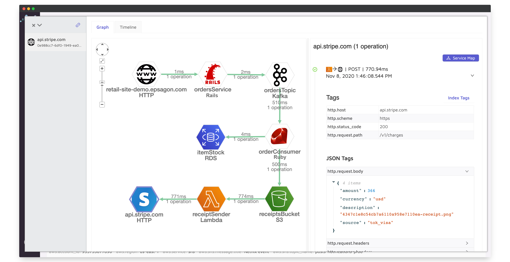

<p align="center">
  <a href="https://epsagon.com" target="_blank" align="center">
    
  </a>
  <br />
</p>

[](https://github.com/semantic-release/semantic-release)

# Epsagon Tracing for Ruby




This package provides tracing to Ruby applications for the collection of distributed tracing and performance metrics in [Epsagon](https://app.epsagon.com/?utm_source=github).


## Installation

To install Epsagon, run:
```sh
gem install epsagon
```

## Usage
**Important: Epsagon is activated and instruments the supported libraries once the module is imported.**

### Auto Tracing

To enable automatic tracing on the supported libraries, add this snippet to your code:
```ruby
require 'epsagon'

epsagon.init()
```

Set the token and app name, and run your Ruby command:
```sh
$ export EPSAGON_TOKEN=<epsagon-token>
$ export EPSAGON_APP_NAME=<app-name-stage>
$ <ruby command>
```

When using inside a `Dockerfile`, you can use `ENV` instead of `export`.

### Integrations

Epsagon provides out-of-the-box instrumentation (tracing) for some popular frameworks and libraries.

|Library             |Supported Version          |
|--------------------|---------------------------|
|net/http            |Fully supported            |
|faraday             |Fully supported            |
|sinatra             |Fully supported            |
|rails               |>=4.0.0                    |
|aws-sdk             |>=2.0.0                    |


### Custom traces

Epsagon for Ruby is based on [OpenTelemetry](https://github.com/open-telemetry/opentelemetry-ruby).
You can use the [`trace`](https://open-telemetry.github.io/opentelemetry-ruby/opentelemetry-api/v0.16.0/OpenTelemetry/Trace.html) API to create custom spans:

```ruby
require 'epsagon'

epsagon.init()

tracer = OpenTelemetry.tracer_provider.tracer('send-test-spans', '0.1.0')

tracer.in_span('my-task') do |span|
  span.set_attribute('task_attribute', true)
  span.set_attribute('another_task_attribute', 42)
  span.set_attribute('yet_another_task_attribute', 'Attirbute value.')
  start_my_task()
  tracer.in_span('inner-task') do |child_span|
    do_traced_subtask()
    child_span.set_attribute('inner_span_attr', 'inner_span_attr value')
  end
  finish_my_task()
end
```

## Configuration

The same settings from the environment variables and additional parameters can be set on initialization, e.g.:

```ruby
require 'epsagon'

epsagon.init({
    metadata_only: true,
    debug: true,
    token: '<epsagon-token>',
    app_name: 'example-app-name',
})
```

The supported parameters are: 

|Parameter               |Environment Variable           |Type   |Default      |Description                                                                        |
|----------------------  |------------------------------ |-------|-------------|-----------------------------------------------------------------------------------|
|token                   |EPSAGON_TOKEN                  |String |-            |Epsagon account token                                                              |
|app_name                |EPSAGON_APP_NAME               |String |-            |Application name that will be set for traces                                       |
|metadata_only           |-                              |Boolean|`False`      |Whether to send only the metadata (`True`) or also the payloads (`False`)          
|debug                   |-                              |Boolean|`False`      |Enable debug prints for troubleshooting                                            


## Getting Help

If you have any issue around using the library or the product, please don't hesitate to:

* Use the [documentation](https://docs.epsagon.com).
* Use the help widget inside the product.
* Open an issue in GitHub.


## Opening Issues

If you encounter a bug with the Epsagon library for Ruby, we want to hear about it.

When opening a new issue, please provide as much information about the environment:
* Library version, Ruby runtime version, dependencies, etc.
* Snippet of the usage.
* A reproducible example can really help.

The GitHub issues are intended for bug reports and feature requests.
For help and questions about Epsagon, use the help widget inside the product.

## License

Provided under the MIT license. See LICENSE for details.

Copyright 2021, Epsagon
